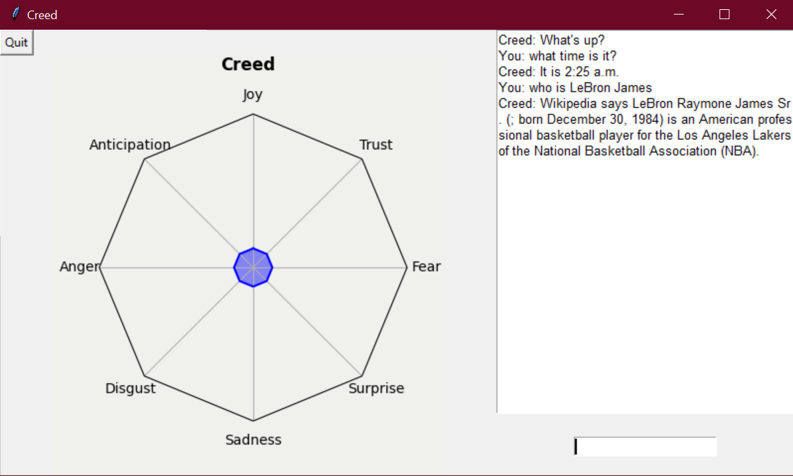

# Creed Bot
Creed bot, named after Creed Bratton from <i>The Office</i>, is an enhanced ai chat bot with virtual assistant capabilities and simulated emotions.
Neural net model created with Pytorch using a relu activation function and 2 hidden layers. GUI created using tkinter animation.

### Screenshots

### Features
Implemented:
- Creed will only respond after the user says or types 'Hey Creed' or 'Yo Creed'
- Creed can: 
    - have a simple conversation with you
    - give you the time and date
    - tell you about a person
    - do a google search
    - look up how to do something on youtube
- chat with creed through tkinter entry
- messages appear in tkinter textbox
- quit button to close Creed
- emotion interface and capabilities

To be implemented:
- Creed cannot:
    - tell you how it is feeling
    - remember what was just said, context (for asking questions and getting answers to questions from users)
    - store/get information from long term memory
    - tell you the weather
- advanced sentiment analysis, what you say affects Creed's "emotions"
    - Creed's emotion affects his responses
- speak (with the mic) to Creed while interface is open

### How to Use?
1. Run creed.py.
2. Prompt will appear asking whether you want to text or speak to Creed
    (speech capabilities not fully implemented yet, so you will have to choose text).
3. Type or say (depending on what you chose) 'hey creed' or 'yo creed'.
4. Creed's interface will open and it will greet you. You can now ask or say whatever you like to Creed.
Note: Creed is not fully developed, so it will not always understand what you are saying.
5. To close the application, press the 'Quit' button in the top left. If you close it via other methods creed.py will 
continue running. Note: You can say goodbye to Creed and it will understand. It will stop listening to you, but the
application won't close.